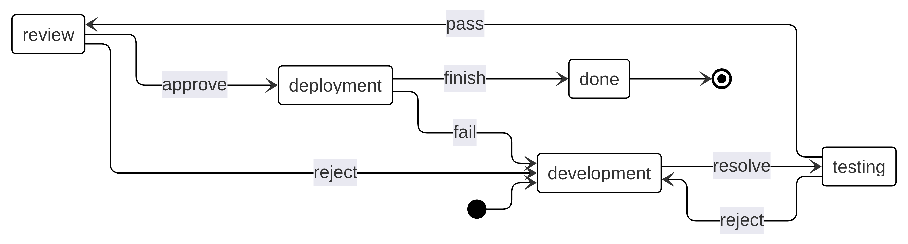

## Getting started

```bash
git clone <repo-url>
cp application/.env.example application/.env
docker compose up -d
docker exec task-tracker-php composer install -d /var/www/application
docker exec task-tracker-php php /var/www/application/artisan migrate --seed
```

---

## How it works

### Task

Task — workflow subject. Har bir task o'zining `task_type` va `present_state` field'lariga ega. `task_type` qaysi workflow config ishlatilishini belgilaydi, `present_state` esa task hozir pipeline'ning qaysi state'ida turganini saqlaydi (masalan `development`, `testing`, `review`). Task o'zi hech qanday ish bajarmaydi — u faqat "nima" va "qayerda" degan context beradi. Barcha amaliy ish checkpoint orqali boshqariladi.

### Checkpoint

Checkpoint — task'ning biror state'dagi aniq bir ish birligi. Task yangi state'ga o'tganda, agar keyingi etap mavjud bo'lsa, avtomatik yangi checkpoint yaratiladi. Har bir checkpoint o'zining mustaqil lifecycle'iga ega — kim oladi, qachon boshlanadi, qachon tugaydi — bularning barchasi checkpoint level'ida track qilinadi.

```
pending → claimed → in_progress → done
```

- **pending** — checkpoint yaratildi, hali hech kim olmagan
- **claimed** — xodim o'zi claim qilganda yoki assign bo'lganda. `responsible_id` shu paytda set bo'ladi
- **in_progress** — ish boshlandi. Transition'lar faqat shu holatda ishlaydi, ya'ni task'ni keyingi state'ga faqat `in_progress` checkpoint orqali o'tkazish mumkin
- **done** — checkpoint bajarildi, task keyingi state'ga o'tishi mumkin

### Symfony Workflow

Har bir `task_type` uchun config'da alohida state machine — state'lar va transition'lar.

Quyida example workflow:



| Transition | From | To |
|---|---|---|
| `resolve` | development | testing |
| `pass` | testing | review |
| `reject` | testing | development |
| `approve` | review | deployment |
| `reject` | review | development |
| `finish` | deployment | done |
| `fail` | deployment | development |

Workflow nima beradi:

- **State management** — task faqat config'da aniqlangan yo'nalishda harakatlanadi
- **Permission-based transitions** — har bir transition'ga permission biriktirilishi mumkin. `my_enabled_transitions` faqat joriy user bajara oladigan transition'larni qaytaradi
- **Event system** — har bir transition oldidan va keyin event'lar fire bo'ladi. Checkpoint yaratish, notification yuborish kabi logic'lar shu orqali ulanadi

Checkpoint `in_progress` ga o'tganda, mumkin bo'lgan transition nomlari `transition_names` da saqlanadi. User ish tugagach transition'ni tanlab task'ni keyingi state'ga o'tkazadi.
